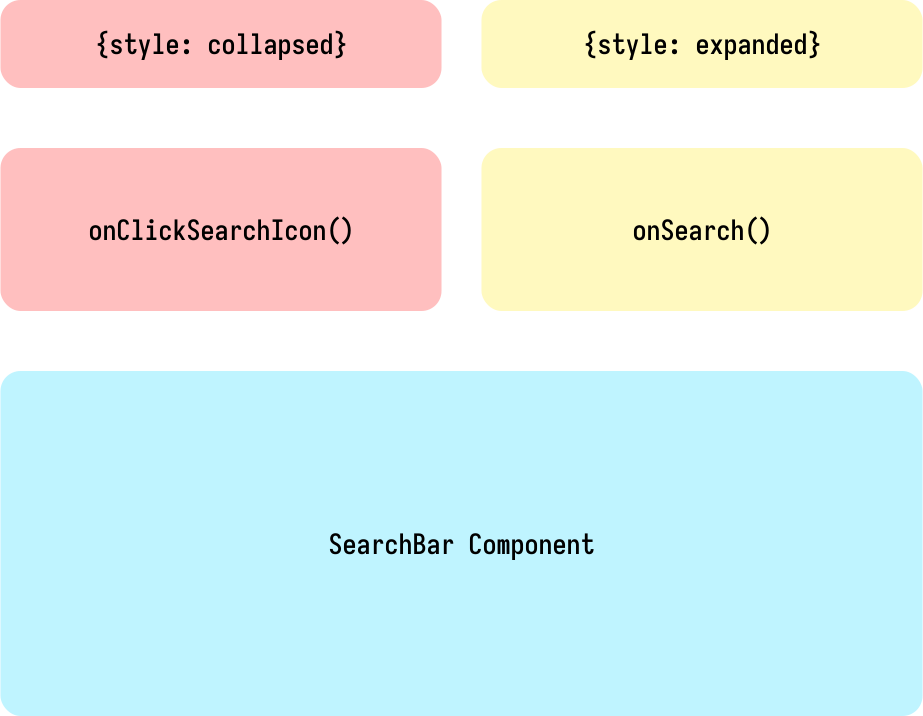

# 嚴格取向的 React 引數傳入

受到 Rust 編譯期發現問題的啟發，想利用 TypeScript 的靜態類型優勢，在編譯期發現 JSX 元件在參數等地方的潛在問題。就以 SearchBar 元件為例，我希望可以在 TypeScript 編譯時就強制規定這個 variant 可以傳入的參數：



以上圖為例，當 style 是 `collapsed` 時，就只能傳入 `onClickSearchIcon`；當 style 是 `expanded` 時，就只能傳入 `onSearch()`。這樣就杜絕了在 `expanded` 按下搜尋 icon 時，意外觸發 `onClickSearchIcon()` 的問題；亦讓元件使用者可以在使用 SearchBar Component 時了解「在 `collapsed` 狀態時，`onSearch()` 不會被觸發。」

## Prototype


## 實作範例

```ts
import type Nullify from "types/nullify";

export enum SearchBarStyle {
  Collapsed,
  Expanded,
}

export type SbSearchIcon = {
  onClickSearchIcon: () => void;
};

export type SbSearchBar = {
  onSearch: (keyword: string) => void;
};

export type SbNSearchIcon = Nullify<SbSearchIcon>;

export type SbNSearchBar = Nullify<SbSearchBar>;

export type SearchBarProps =
  | ({ type: SearchBarStyle.Collapsed } & SbSearchIcon & SbNSearchBar)
  | ({ type: SearchBarStyle.Expanded } & SbNSearchIcon & SbSearchBar);

export const SearchBar = (props: SearchBarProps) => {
  /* wip */
};
```

## 使用範例

```tsx
<SearchBar
  // TypeScript 會自動根據 SearchBarProps 的定義，判斷何者是需要的 props。
  type={SearchBarStyle.Collapsed}
  // 只在有用到 onSearch 的時候傳入 onSearch handler，反之就不傳入杜絕 bugs。
  onSearch={SearchBarStyle.Expanded ? onSearch : null}
  // 同上。
  onClickSearchIcon={SearchBarStyle.Collapsed ? onClickSearchIcon : null}
/>
```
